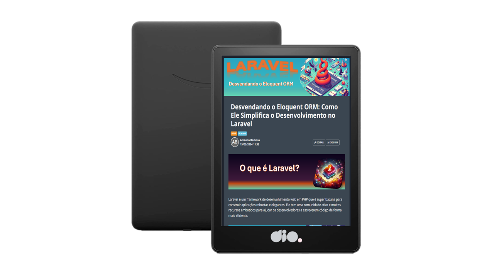

    

  
  

-------

  

# Projeto artigo técnico gerado por I.A.s

 > ℹ️ **NOTE:** Este é o repositório desenvolvido durante o curso no qual fui aluna na plataforma da [DIO](https://dio.me).

  

Projeto com o objetivo de gerar um artigo técnico com um layout rico, leitura agradável e com foco em promover sua autoridade técnica.

<a href="https://web.dio.me/articles/desvendando-o-eloquent-orm-como-ele-simplifica-o-desenvolvimento-no-laravel?back=%2Farticles&open-modal=true&page=1&order=oldest" title="View PDF now"> 📕Clique aqui para ler o artigo</a>

## 💻 Tecnologias utilizadas no projeto

- [ChatGPT](https://chat.openai.com/) - para título e conteúdo
- [Bing.com](https://www.bing.com/) - para gerar imagens
- [PowerPoint](https://www.microsoft.com/en/microsoft-365/powerpoint) - Para formatação de banners e Layouts

## 📄 Prompts e ferramentas

ChatGPT：

|   Ação   | prompt                                                                                                                                                                                                                                                                         |
| :------: | ------------------------------------------------------------------------------------------------------------------------------------------------------------------------------------------------------------------------------------------------------------------------------ |
|  título  | Crie 5 headlines para nomes de artigos sobre o assunto Laravel - Eloquent ORM                                                                                                                                                                                                    |
| conteúdo | Comporte-se como um escritor de artigos tech back-end e escreva o Artigo atendendo as regras abaixo

{REGRAS}
> No máximo 5 linhas por blocos de explicação
> Me explique de maneira informal, como se eu fosse um desenvolvedor Laravel Júnior
> Os blocos que serão criados estão abaixo:
- O que é o Laravel
- O que é Eloquent ORM
- Como o Eloquent ORM facilita o trabalho com o framework Laravel
- Fale sobre Generating Model Classes e Eloquent Model Conventions com exemplos com código
- Cite pelo menos 3 exemplos de código, com uma breve descrição, utilizando o método tradicional Laravel versus utilizando o Eloquent ORM
- Faça um call to action para as minhas redes sociais
- Coloque 3 hashtags que façam sentido|

Bing.com：

- No Bing gerei imagens. Os termos de pesquisa que utilizei durante a gravação do conteúdo foram:

• Crie 5 headlines para nomes de artigos sobre o assunto Laravel - Eloquent ORM

## ✨ Features

- Conteúdo gerado via ChatGPT
- Imagens geradas via Bing.com

## 📚 Materiais

- prompts utilizados

## 🛠️ Instruções de execução

Utilize os prompts acima nas ferramentas sugeridas para gerar o material base e utilize uma ferramenta de edição de documentos como power point, libreoffice , indesign para diagramação, o passo a passo em vídeo pode ser conferido na plataforma da [DIO](https://dio.me).

## 👨‍💻 Expert

    
    
&nbsp&nbsp&nbspAmanda Barbosa 
    &nbsp&nbsp&nbsp
    <a href="https://github.com/AMD1989">
    GitHub</a>&nbsp;|&nbsp;
    <a href="https://www.linkedin.com/in/amanda-barbosa-6153171a4/">LinkedIn</a>
&nbsp;|&nbsp;

  

---

⌨️ com 💜 por [Amanda Barbosa](https://github.com/AMD1989)